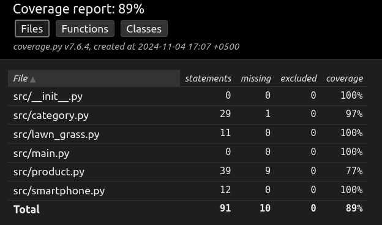

# Проект OOP Homework

Этот проект представляет собой домашнюю работу базовый пример использования объектно-ориентированного программирования (OOP) в Python.

## Структура проекта
oop_homework/ 

│ ├── src/ 

│ ├── init.py

│ ├── category.py

│ ├── base_product.py

│ ├── print_mixing.py

│ ├── product.py

│ ├── lawn_grass.py

│ ├── smartphone.py

│ └── main.py

│ ├── tests/

│ ├── __init__.py

│ ├── conftest.py

│ ├── report.png

│ ├── test_print_mixing.py

│ ├── test_category.py

│ ├── test_lawn_grass.py

│ ├── test_product.py

│ └── test_smartphone.py

│ ├── .gitignore

│ ├── .coverage

│ ├── poetry files ...

│ ├── ...

│ └── README.md

└── External Libraries

### Основные классы

1. `Product`:
   - Представляет товар со свойствами: имя, описание, цена, количество.
   - Имеет метод `__init__()` для инициализации объекта.
   - Для класса Product переопределен метод str, который возвращает строку: Название продукта, X руб. Остаток: X шт.
   - Для класса Product создан класс-метод new_product который 
   будет принимать на вход параметры товара в словаре и возвращать созданный объект класса Product
   - Для класса Product сделаны атрибут цены приватным и описаны геттеры и сеттеры.
   - Добавлено метод строковое отображение названия, цены, остатка на складе.
   - Добавлен метод сложения всей стоимости всего товара на складе.
   - Добавлено отлавливание ошибки запроса нулевого количества
      `Product`:
     - Добавлены модули с наследуемыми классами категория товара
     - Модуль с дочерним классом Smartphone
     - Модуль с дочерним классом LawnGrass
     - Добавлены родительские классы абстрактный BaseProduct и миксин PrintMixin
     

2. `Category`:
   - Представляет категорию товаров со свойствами: имя, описание, список продуктов.
   - Имеет статические переменные для подсчета количества категорий и продуктов.
   - Имеет метод `__init__()` для инициализации объекта.
   - Функциональность для добавления продуктов в категорию.
   - Реализована проверка: в случае если цена равна или ниже нуля, выводится сообщение в консоль “Цена не должна быть нулевая или отрицательная” 
   - Реализована логика подтверждения пользователем согласия понизить цену. В случае если пользователь вручную вводит y (значит yes) цена товара понижается, если n (значит no) происходит отмена действия. 
   - Для класса Category переопределен метод str, который возвращает строку: Название категории, количество продуктов: X шт. 
   - Метод str рассчитывает общее количество товаров на складе (quantity) для каждого продукта в приватном атрибуте products
   - Добавлен метод строкового отображения имя категории, количество товаров
   - Добавлен class подсчитывающий средний ценник всех товаров
               

3. `PrintMixin` (in module print_mixin.py):
   - Родительский класс срабатывающий параллельно с классом наследником
   - Функционал - Вывод информации из модуля наследника в консоль

4. `BaseProduct` (in module base_product.py):
   - Абстрактный класс универсального вида применения

## Использование

Пример создания и использования объектов:
Запустите модуль crs.main.py с примерами ввода и получения обработанных данных.